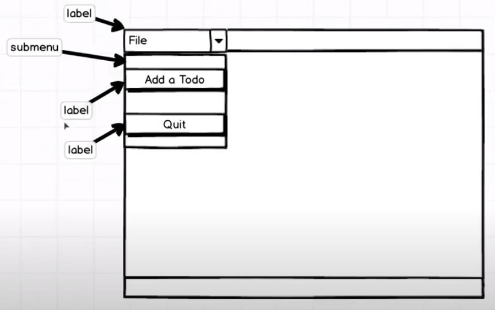
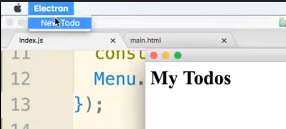
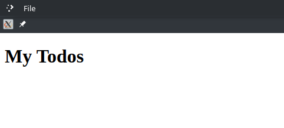
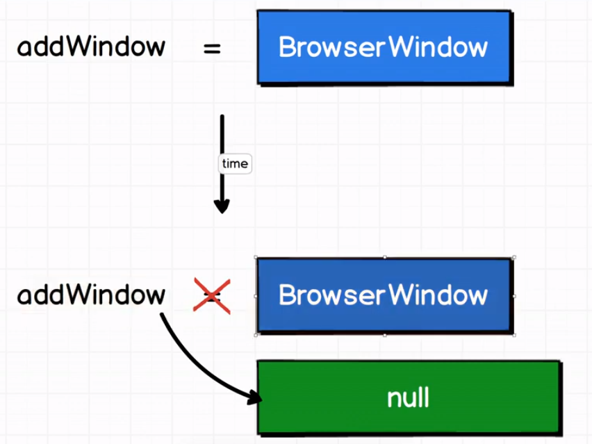

# Electron Js Tutorial Notes - Todos
___
### Creating Todos application
- Tools:
    - Electron

- [github](https://github.com/YoussefMo7amed/learning/tree/main/JavaScript/electronjs/todos)
___
### Constructing menu bars
- Notes:
    - menu bars in windows and mac are different.
    
        - there is menu, and submenu.

calling menu object from electron module:
```js
const { app, BrowserWindow, Menu } = electron;
```
whenever we want to create a menu, we first need to do is to create a menu template, which is an object or an array that kind of is structured like how we want our menu to be put together.
```js
// every object has at least one property (which is label)
const menuTemplate = [{ label: "File" }];
```
Each menu that we add to this menu template corresponds to a single drop down on the status bar on the top.

vscode for example has 8 objects [file, edit, selection, view, go, run, terminal, help]

we call the menuTemplate array and pass it to buildFromTemplate method
```js
app.on("ready", () => {
    mainWindow = new BrowserWindow({});
    mainWindow.loadURL(`file://${__dirname}/main.html`);

    // building menu
    const mainMenu = Menu.buildFromTemplate(menuTemplate);
    // we have to add this function to put in use this menu
    Menu.setApplicationMenu(mainMenu);
});
```
but why there are two steps? why not just pass menuTemplate and be created?
- maybe if we have several different windows inside of our application we want the menubar at the top to change over time
so it's possible that we might be calling set application menu several times.
*actually after running the above code you won't see the menu bar* 😅
#### Gotcha
- when you aren't specifing the menu bar, it loads the default one with its keybindings, (e.g. restart), but when you start specifing it, you will need to customize all your keybindings.
- now to let it works we need to add some other things:
```js
const menuTemplate = [
    {
        label: "File",
        submenu: [{ label: "todos" }],
    },
];
```

now it works, but there is a problem with mac, which it will show first label as the app name (electron),
    

while in windows and linux it will normaly show app name and first label (File)
    

we can add first object in array as empty object, that works for mac but not the others!
so we can twick it by know the OS and if it is mac we add empty object at first
```js
    // mac, ios, and all apple related OSs based on 'darwin'
    if(process.platform === 'darwin'){
        menuTemplate.unshift({}); // add empty object at first
    }
```
now we need to add action to the label.
we do that by adding onclick() callback function
```js
const menuTemplate = [
    {
        label: "File",
        submenu: [
            { label: "New Todo" },
            {
                label: "Quit",
                click() {
                    app.quit();
                },
            },
        ],
    },
];
```
You can also add keybinding by adding "accelerator" key and the shortcut as string
```js
{
    label: "Quit",
    accelerator: "Command+Q",
    click() {
        app.quit();
    },
},
```
we can also pass a function instead of string to handle different OSs
an immediately invoked function
```js
{
    label: "Quit",
    accelerator:
        (() => {
            if (process.platform === "darwin") {
                return "Command";
            } else {
                return "Ctrl";
            }
        })() + "+Q",
    click() {
        app.quit();
    },
},
```
or shorten it by ternary expression
```js
{
    label: "Quit",
    accelerator:
        process.platform === "darwin" ? "Command" : "Ctrl" + "+Q",
    click() {
        app.quit();
    },
},
```
You can also handle both by
```js
accelerator: "CmdOrCtrl+Q"
```
or
```js
accelerator: "CmdOrCtrl" + "+Q",
```

### Creating separate windows
You can add new small window when click on create new todo
```js
function createAddWindow() {
    addWindow = new BrowserWindow({
        width: 300,
        height: 200,
        title: "add new todo",
    });
}
```
and call it when user click on "add new todo"
```js
{
    label: "New Todo",
    click() {
        createAddWindow();
    },
}
```
#### Issue
When you close the main window, the small one doesn't close automatically.

### Adding polish to electron
You can add line on "ready" event that when user close the main windwo, the whole application close
```js
app.on("ready", () => {
    // some code ....
    mainWindow.on("closed", () => {
        app.quit();
    });
});
```
### Restoring developer tools
Defently you don't want the user to open the developer tools, so you can adding it if you are in develpment enviroment then remove if you are in prodaction enviroment.
```js
process.env.NODE_ENV
```
Note that in click() function there are 2 arguments: item and focusedWindow
```js
click(item, focusedWindow){}
```
so we can use this to turn on dev tools on specific window (the window that we want)
```js
if (process.env.NODE_ENV !== "producation") {
    menuTemplate.push({
        label: "View",
        submenu: [
            {
                label: "Toggle Developer Tools",
                accelerator: "CmdorCtrl" + "+Shift+I",
                click(item, focusWindow) {
                    focusWindow.toggleDevTools();
                },
            },
        ],
    });
}
```
### ipc between windows
as we did before, we send data throw ipc
*add.html*
```js
const electron = require("electron");
const { ipcRenderer } = electron;
document.querySelector("form").addEventListener("submit", (event) => {
    event.preventDefault();
    value = document.querySelector("input").value;
    ipcRenderer.send("input:add", value);
});
```
*index.js*
```js
ipcMain.on("input:add", (event, data) => {
    mainWindow.webContents.send("input:add", data);
    // this line to automatically close the window.
    // but it's a poor practice to just use it, we need something with it.
    addWindow.close();
});
```
- Note about *addWindow.close()* method in next section

*main.html*
```html
</head>
<body>
    <h1>My Todos</h1>
    <ul id="todos"></ul>
</body>
<script>
    const electron = require("electron");
    const { ipcRenderer } = electron;
    ipcRenderer.on("input:add", (event, data) => {
        let todos = document.getElementById("todos");
        let li = document.createElement("li", (nodeValue = data));
        li.append(data);
        todos.appendChild(li);
    });
</script>
```
### Garbage collection with electron
We here mean what JS does with the object that no longer needed after using it.

this photo what happens is you occupy space in memory,
if you need to remove the object from the memory you need your variable to be null or to refer to another object.

when using
```js
    addWindow.close();
```
you just tell the language that i don't need this window anymore, but that doen't mean that you cleared it from the RAM!
so we need it to be null after that.

2 methods to solve it.
- first
    ```js
        addWindow.close();
        addWindow = null
    ```
- second
    ```js
        function createAddWindow() {
            /* some code..  */
            addWindow.loadURL(`file://${__dirname}/add.html`);
            addWindow.on("close", () => (addWindow = null));
        }
    ```

### Role shortcuts
You can add Reload shortcut without completely write object properties
```js
if (process.env.NODE_ENV !== "producation") {
    menuTemplate.push({
        label: "View",
        submenu: [
            {
                role: "reload", // HERE
            },
            {
                label: "Toggle Developer Tools",
                accelerator: "CmdorCtrl" + "+Shift+I",
                click(item, focusWindow) {
                    focusWindow.toggleDevTools();
                },
            },
        ],
    });
}
```
Electron has a number of preset role options available one of which is reload, so when Electron see the option of role wih reload so he will add all what you need.
