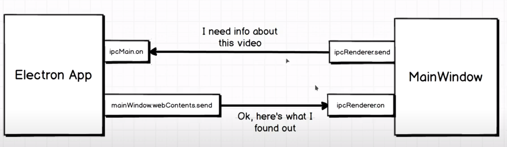

# Electron Js Tutorial Notes - Code

- index.js file is gonna contain all the
    - logic related to our application
    - the electron side of things (not events or these things)
___
### Creating Video Info application
- select a video and return the video length
- Tools:
    - Electron
    - fluent-ffmpeg
- [github](https://github.com/YoussefMo7amed/learning/tree/main/JavaScript/electronjs/videoInfo)
___

### Life cycle of events
- electron starts
- app process is created
- app ready to start doing things
- ....
- app closes down

### App
It represents the overall running process of electron on our machine.

```js
const electron = require('electron');
```

```js
const {app} = electron;
app.on('ready', () => {
    console.log('App is now ready');
});

```
```js
const {app, BrowserWindow} = electron;
// Create a window using BrowserWindow module
app.on('ready', () => {
    const mainWindow = new BrowserWindow({});
    mainWindow.loadURL(`file://${__dirname}/index.html`);
});

```
```js
const {app, BrowserWindow} = electron;
// Create a window using BrowserWindow module
app.on('ready', () => {
    mainWindow = new BrowserWindow({
        // I added this object because of nodeIntegration is false by default (true WAS the default)
        // this object for writting nodejs code inside HTML
        // but in best practices try to avoid these because it uses nodejs it self (can access and do anything nodejs can)
        webPreferences: {
            nodeIntegration: true,
            contextIsolation: false
        }
    });
    mainWindow.loadURL(`file://${__dirname}/index.html`);
});

```
___

### Selecting videos
- In any web site we can get details about files that user purposefully feeds into it.
    - we can use < input > tag that in HTML

- In Electron can read any arbitrary file off the machine at any time.

### Reading file details
using

```HTML
<script>
      document.querySelector("form").addEventListener("submit", (event) => {
        event.preventDefault();
        const file = document.querySelector("input").files[0];
      });
</script>
```
___
### Require statements in the browser
#### Electron App:
Electron specific configuration and logic
#### Web App:
Keep as generic as possible, increases possible reuse on plain web

### IPC system
we will use the IPC (Inter Process Communication) to communicate between Electron app and mainWindow

- The browser window has some additional capibalilies that chrome doesn't
    - You can use the "require" word in electron (note that the browser doesn't support it)
    - Node + Browser = mainWindow

#### IPC communication


- get the modules
```js
const {app, BrowserWindow, ipcMain} = electron;
```
- mainWindow (*index.html*)
    - ipcRenderer.send *sending event and data* - here we send from index.html under the *script* tag to index.js
        ```js
        const electron = require("electron");
        const { ipcRenderer } = electron;
        event.preventDefault();
        const { path } = document.querySelector("input").files[0];
        // we create an event, you can name it anything
        // we send event name, data to electron app
        ipcRenderer.send("video:submit", path);
        ```
    - ipcRenderer.on *recieve from electron* - here from index.js
        ```js
        // ... some code ...
        ipcRenderer.on("video:duration", (event, duration) => {
            document.getElementById("result").innerHTML = `Video is ${duration}`;
        });
        ```
- Electron (*index.js*)
    - ipcMain.on *recieve from mainwindow* - here from index.html
        ```js
        // first arg has some data about the process that sent this event,
        //  you can got dive separate windows inside of our app and any one of them could trigger this event,
        //   so you know that from event object
        // second arg is the data
        ipcMain.on('video:submit', (event, path) => {
            ffmpeg.ffprobe(path, (err, metadata) => {
                console.log('video duration is \t' + metadata.format.duration);
            });
        });
        ```
    - mainwindow *send to mainWindow* - here to index.html
        ```js
        ipcMain.on('video:submit', (event, path) => {
            ffmpeg.ffprobe(path, (err, metadata) => {
                duration = metadata.format.duration
                mainWindow.webContents.send('video:duration', metadata.format.duration)
            });
        });
        ```
